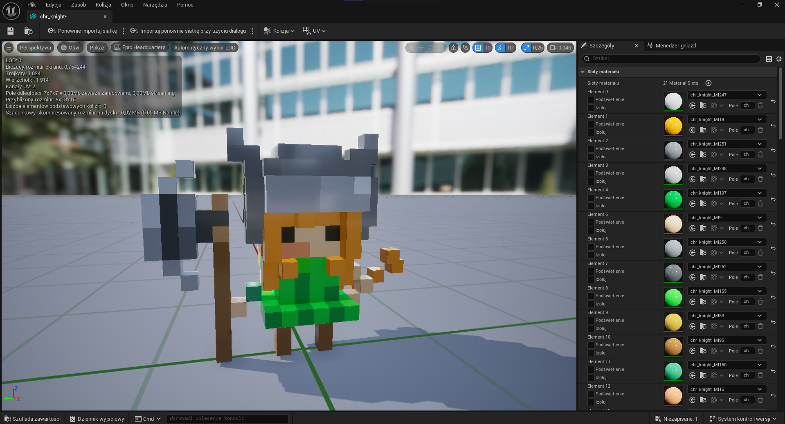
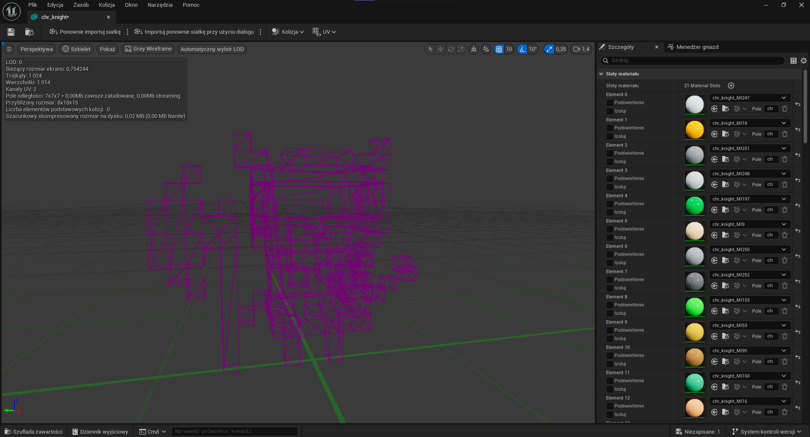
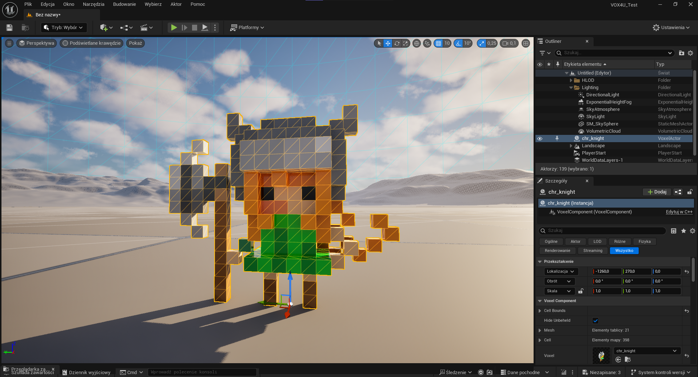

# VOX4U

Import [MagicaVoxel](https://ephtracy.github.io/index.html?page=mv_main) `.vox` format file to [Unreal Engine 5](https://www.unrealengine.com/).

Original Creator Repositorium: [VOX4U Original](https://github.com/mik14a/VOX4U)

Tested with **Unreal Engine 5.5.4**

## Description

Import voxel objects to **StaticMesh** or **Voxel** — no need to use any other digital content creation tools. If the .vox file contains multiple models, you can also choose to separate them during import. Additionally, you can scale the object to match your desired scene size or proportions and rename it to keep your content better organized.

### Static Mesh



Generate a static mesh from voxel data with flexible material handling options:
- **Single-material mode** - uses a single material with a texture generated from the color palette. This mode only preserves color information — **no additional MagicaVoxel material properties are applied**.
- **Multi-material mode** - uses multiple materials, **fully preserving MagicaVoxel material properties** such as metalness, glass, emissive, and more. Optionally, the Color node in each material can be replaced with a palette-generated texture while keeping all other attributes intact.

#### Mesh optimized



Mesh generation use [a monotone decomposition algorithm](https://0fps.net/2012/07/07/meshing-minecraft-part-2/).

### Voxel



Generate a voxel asset using an Instanced Static Mesh Component, with automatic cube-mesh creation and material generation based on the palette.
- **Single-material mode** - uses a single material with a texture generated from the color palette. This mode only preserves color information — **no additional MagicaVoxel material properties are applied**. Each voxel receives unique texture coordinates corresponding to its color's position within the texture.
- **Multi-material mode** - uses multiple materials, **fully preserving MagicaVoxel material properties**. Optionally, the Color node in each material can be replaced with a palette-generated texture while keeping all other properties intact.

If runtime access to the Voxel Actor is not required, the runtime module can be removed from the `.uplugin` file, allowing packaging without the runtime module.

## VOX Format

Supported version: **200 and below**

**Supported chunks:**
- All basic chunks
- `MATL`

**Unsupported chunks:**
- `rCAM`
- `rOBJ`
- `IMAP`
- `nTRN`
- `nGRP`
- `nSHP`
- `LAYR`
- `NOTE`

**Supported materials:**
- Diffuse
- Metal
- Glass
- Emissive

## Usage

Drag & Drop `.vox` file to content panel or open import dialog and select
**MagicaVoxel(*.vox)** files.\
During import, you can:
- choose whether to import as **Static Mesh** or **Voxel Asset**,
- **rename the imported asset** directly in the import dialog,
- **separate the models** stored in the `.vox` file or **merge them** into a single asset,
- adjust **scale** and **material import options** before confirming the import.

## Installation
Clone the plugin into your Unreal project:
```sh
cd {YourUnrealProject}
git clone https://github.com/Muppetsg2/VOX4U.git ./Plugins/VOX4U
```

Or add it as a submodule:

```sh
cd {YourUnrealProject}
git submodule add https://github.com/Muppetsg2/VOX4U.git ./Plugins/VOX4U
```
Alternatively, you can download the precompiled binary from the plugin [release page](https://github.com/Muppetsg2/VOX4U/releases/latest) and copy it directly into the same `Plugins/VOX4U` folder.

If you are creating a package without C++ access, copy the plugin to the `Engine/Plugins/Runtime` directory.

## Debugging

If you experience build issues with the plugin, use the [UnrealEnginePluginMigrationTool](https://github.com/mickexd/UnrealEnginePluginMigrationTool) to rebuild it and review the console output for detailed error messages.

## License

[MIT License](https://github.com/Muppetsg2/VOX4U/blob/master/LICENSE)
